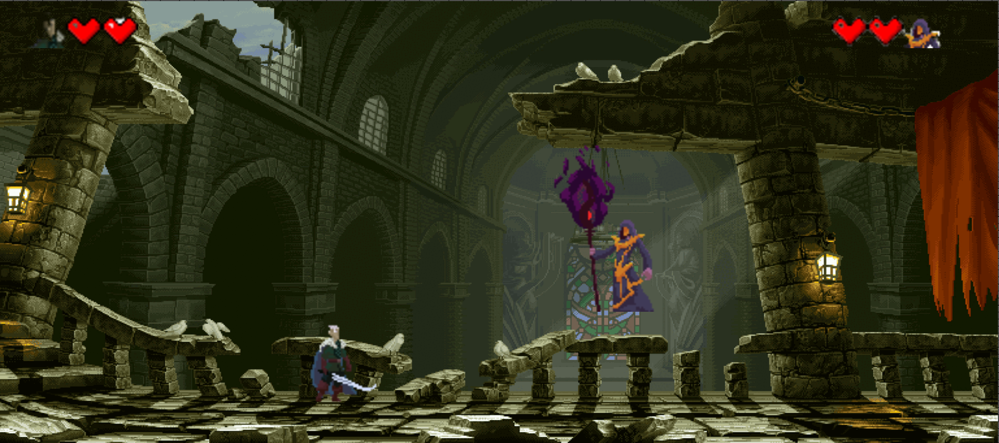

# Simple Game

  

  <em>This is a simple game I made as a class assignment.</em>

<h2>Instructions</h2>

<strong>To play:</strong>

<ol>
  <li>Clone the repository.</li>
  <li>Open <code>index.html</code>.</li>
</ol>

<strong>Adjust the game to your computer screen:</strong>

<ul>
  <li>Modify your browser zoom.</li>
</ul>

<h2>Controls</h2>

<table>
  <thead>
    <tr>
      <th>Mage</th>
      <th>Rogue</th>
    </tr>
  </thead>
  <tbody>
    <tr>
      <td>
        <ul>
          <li><strong>Movement:</strong> Arrow keys</li>
          <li><strong>Attack:</strong> <code>L</code></li>
          <li><strong>Push away:</strong> <code>K</code></li>
        </ul>
      </td>
      <td>
        <ul>
          <li><strong>Movement:</strong> <code>W</code>, <code>A</code>, <code>S</code>, <code>D</code></li>
          <li><strong>Attack:</strong> <code>J</code></li>
        </ul>
      </td>
    </tr>
  </tbody>
</table>

